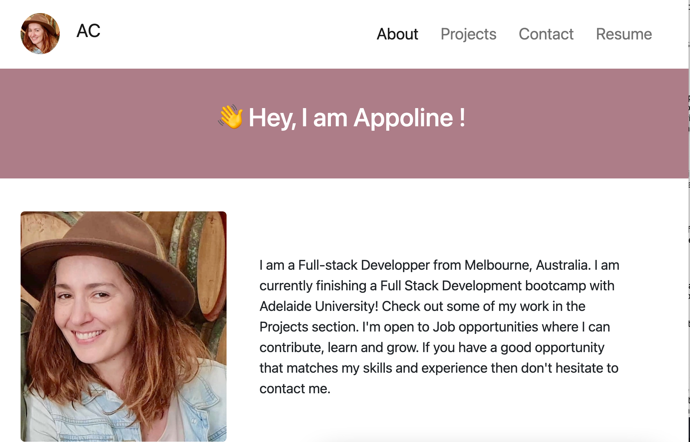

# React Portfolio

## Table of content

- [Description of Project](#description-of-project)
- [Project Requirements](#project-requirements)
- [What I have learned](#what-i-have-learned)
- [Challenges](#challenges)
- [Link to deployed application](#link-to-deployed-application)
- [Screenshot of deployed application](#screenshot-of-deployed-application)

## Description of Project

This project is a single-page application portfolio using React. It features all the most important projects I have been working on as part of my full stack bootcamp.

## Project Requirements

Here are the main requirements of the project:

- When I load the portfolio then I am presented with a page containing a header, a section for content, and a footer
- When I view the navigation titles then I am presented with the titles About Me, Portfolio, Contact, and Resume, and the title corresponding to the current section is highlighted
- When I click on a navigation title then I am presented with the corresponding section below the navigation without the page reloading and that title is highlighted
- When I am presented with the About Me section then I see a recent photo or avatar of the developer and a short bio about them
- When I am presented with the Portfolio section then I see titled images of six of the developer’s applications with links to both the deployed applications and the corresponding GitHub repository
- When I am presented with the Contact section then I see a contact form with fields for a name, an email address, and a message
- When I am presented with the Resume section then I see a link to a downloadable resume and a list of the developer’s proficiencies
- When I view the footerr then I am presented with text or icon links to the developer’s GitHub and LinkedIn profiles, and their profile on a third platform (Stack Overflow, Twitter) 

## What I have learned 
I have been able to implement React hooks learned in class as well as new hooks to build my portfolio. I have also learned how to successfully implement bootstrap with React, making sure that my portfolio is fully responsive.

## Challenges
Deploying the application to github pages was initially tricky but after going through the steps a few times I was eventually able to implement a successful deployment.

### Link to deployed application

[Link to deployed application](https://appolinefr.github.io/React-Portfolio/)

### Screenshot of deployed application

